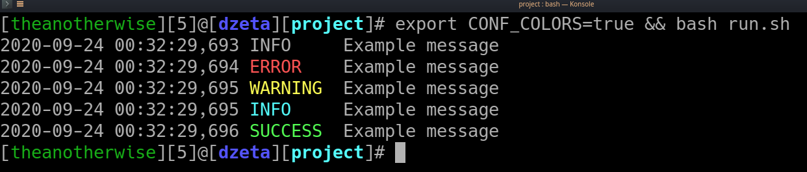

# BASH Logger

## Script
```bash
#!/bin/bash

CONF_COLORS="$CONF_COLORS"

function formatter {
  DATE="`date +\"%Y-%m-%d %H:%M:%S,%3N\"`"

  if [[ "${CONF_COLORS}" == "true" ]] ; then
    echo -e "${DATE} \e[${3}m${1}\e[m\t ${2}"
  else
    echo -e "${DATE} ${1}\t ${2}"
  fi
}

function messager {
  if [ "${#}" -eq "2" ] ; then
    if [ "${2}" == "error" ] ; then
      formatter "ERROR" "${1}" "91"
    elif [ "${2}" == "success" ] ; then
      formatter "SUCCESS" "${1}" "92"
    elif [ "${2}" == "warning" ] ; then
      formatter "WARNING" "${1}" "93"
    elif [ "${2}" == "info" ] ; then
      formatter "INFO" "${1}" "96"
    else
      formatter "LOGGER" "Incorrect logger type: '${2}'.." "31" && exit 4
    fi
  elif [ "${#}" -eq "1" ] ; then
    formatter "INFO" "${1}" "0"
  fi
}

function logger {
  [ "${#}" -lt 1 ] || [ "${#}" -gt 2 ] && exit 1

  if [ "${#}" -eq "1" ] ; then
    [ -z "${1}" ] && exit 2 || messager "${1}"
  fi

  if [ "${#}" -eq "2" ] ; then
    [ -z "${1}" ] || [ -z "${2}" ] && exit 3 || messager "${2}" "${1}"
  fi
}

# simple message
logger "Example message"              

# message with log type
logger "error" "Example message"
logger "warning" "Example message"
logger "info" "Example message"
logger "success" "Example message"
```

## Print all possible colors
```bash
for ID in `seq 120` ; do echo -e "\e[${i}mMESSAGE\e[m ${ID}" ; done
```

## Screenshot


